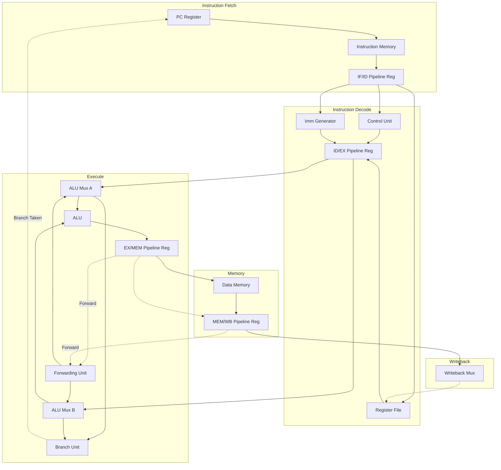

# rv32-core-dv — RV32I core with a full verification flow

[](https://github.com/Madhav0013/rv32-core-dv/actions/workflows/ci.yml)

> Every cell in the results table below is either a measured number with a
> committed artifact behind it, or `—`. A dash means *not yet measured*, never
> *estimated*. `scripts/audit.py` checks this mechanically and fails if a claim
> outruns its evidence.

A 5-stage pipelined RV32I processor, verified the way a processor DV team would verify one: against a golden reference model on every retired instruction, against the official RISC-V architectural test suite, with constrained-random stimulus, and with bounded formal proofs. **The verification is the point.** A working RV32I core is a well-trodden exercise. What this repository is about is that every correctness claim below is backed by a command a stranger can run, and by a CI log they can read. The comparator that produced these numbers has its own self-test, because a checker nobody checks is not evidence.

---

## Results

| Metric | Value | Produced by |
|---|---|---|
| RV32I architectural tests passing | **41 / 41** | `make arch` — see [`riscof_work/report.html`](riscof_work/report.html) |
| RV32M architectural tests passing | — | M extension not implemented |
| Random programs co-simulated vs. Spike | 20 | `make random` |
| Instructions co-simulated (total) | 98,718 | `make random` |
| Functional coverage | — | `make coverage` |
| Formal properties proven / bound depth | — | `make formal` |
| Verilator lint warnings | 0 | `make lint` |

---

## Block Diagram



---

## Verification methodology

Every level below catches a class of bug the level beneath it structurally
cannot.

**Block level.** Each combinational unit is checked against an independent
Python reference model written from the specification, never from the RTL.
`tb/cocotb/test_alu.py` is the pattern the whole repo follows.
→ `make unit`

**Instruction level — Spike lockstep.** The core and Spike execute the same ELF,
and architectural state is diffed on every retired instruction. Divergence
localizes to a single instruction with a decoded "likely cause" report, so a
failure points at a waveform timestamp rather than a haystack.
→ `make cosim`

**ISA level — RISCOF.** The official RISC-V architectural test suite. Each test
writes a memory signature; the signature is diffed against the reference model's.
→ `make arch`

**System level — riscv-dv.** Constrained-random program generation, run through
the same lockstep comparator. Uses `--simulator=pyflow` so no commercial
SystemVerilog simulator is required.
→ `make random`

**Proof level — riscv-formal.** Bounded model checking of the RVFI ISA
conformance properties over all input sequences up to a stated depth.
→ `make formal`

---

## Quick start

```bash
git clone <this-repo> && cd rv32-core-dv
./scripts/setup.sh          # Verilator, Python deps, RISC-V GCC, Spike
source scripts/env.sh
make regress                # lint + block tests + architectural suite
```

Individual targets:

```bash
make lint       # Verilator lint (must always be silent)
make unit       # cocotb block-level tests
make arch       # RISCOF architectural compliance
make random     # riscv-dv random regression + Spike lockstep
make formal     # riscv-formal bounded model checking
```

---

## Repository layout

```
rtl/core/       synthesizable RTL, one module per file
rtl/soc/        memory models + simulation top level
tb/cocotb/      block-level tests (fast, run on every commit)
tb/lockstep/    Spike co-simulation comparator
tests/asm/      directed assembly programs
tests/riscof/   RISCOF DUT plugin
formal/         riscv-formal wiring
sw/             crt0.S, linker script
scripts/        setup and regression drivers
docs/           design decisions, verification plan, debug log
```

---

## Documentation

| Document | What it is |
|---|---|
| [`IMPLEMENTATION.md`](IMPLEMENTATION.md) | The build manual — phases, commands, explanations |
| [`docs/microarchitecture.md`](docs/microarchitecture.md) | Design decisions and their rationale |
| [`docs/verification_plan.md`](docs/verification_plan.md) | Coverage model and what is *not* verified |
| [`docs/debug_log.md`](docs/debug_log.md) | Bugs found, how they were localized, and the fix |
| [`docs/progress.md`](docs/progress.md) | Build log, newest first |

---

## What is not verified

Stated deliberately — see [`docs/verification_plan.md`](docs/verification_plan.md) §A4 for the full list. Key gaps:
- M extension not implemented, therefore not verified.
- no interrupts; trap coverage limited to illegal instruction, misaligned access, ECALL and EBREAK.
- functional coverage not measured.
- formal results are bounded at depth 15 for insn, shallower for other check classes — not unbounded.
- no timing, area, frequency or power claim is made.

---

## License

MIT — see [LICENSE](LICENSE).
